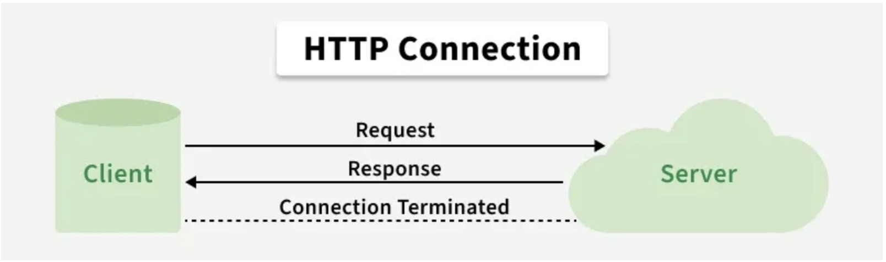
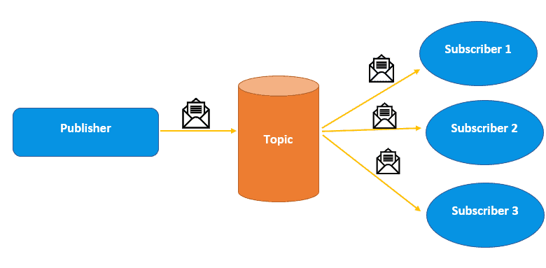

# Fundamentals of Backend Engineering

## Communication Design Patterns

### Request-response

*Do you have that? Sure, here it is.*


- Client sends a message

- Server parses requests

- Server processes request

- Server sends response to client

- Client parses the request and consumes it

#### Examples of uses of request-response

- Web, HTTP, DNS, SSH

- RPC

- SQL and Database protocols

- APIs (REST, SOAP, GraphQL)

##### HTTP is a good example of the request-response pattern



Reference: [Hypertext Transfer Protocol - HTTP - GeeksforGeeks](https://www.geeksforgeeks.org/html/what-is-http/)

A communication structure needs to be agreed upon by both the **client** and **server**. The HTTP Protocol is an example of that agreement: a specific format for how the communication will take place.

```http
// Request
GET / HTTP/1.1
Host: example.com
User-Agent: curl/8.7.1
Accept: */*

// Response
HTTP/1.1 200 OK
Content-Type: text/html
Transfer-Encoding: chunked
Connection: keep-alive
```

### Synchronous and Asynchronous workflows

*Working while waiting.*

**Synchronous work:**

- Client sends a request to the server

- Client blocks; cannot execute any other code while waiting for response

- Server responds, client processes response and finally unblocks

**Asynchronous work:**

- Client sends a request to the server

- Client continues to work on other tasks while waiting for the response
  
  - Caller can either:
    
    - Check it response is ready (epoll)
    
    - Server (receiver) calls back when it is done (io_uring)
    
    - Spin up new thread that blocks

- Client (caller) and server (receiver) are not necessarily in sync.

Simple example with `fetch`

```js
// Modern async/await (still non-blocking!)
async function getData() {
  const response = await fetch('https://api.example.com/data');
  const data = await response.json();
  console.log(data);
}
getData();
console.log("Runs immediately!");

// Output:
// "Runs immediately!"  ← prints first
// (data)               ← prints later, when response arrives
```

### Push

*Send data to the client without having them to ask for it.*

> Push technology, also known as server push, is a communication method where the communication is initiated by a server rather than a client. This approach is different from the "pull" method where the communication is initiated by a client. 
> 
> [Push technology - Wikipedia](https://en.wikipedia.org/wiki/Push_technology)


Push requires:

- Client subscribes/connects once

- Server pushes data thereafter without further client requests

- The protocols that implement Push are usually **bidirectional**


Examples:

- WebSockets (bidirectional push)

- Server-Sent Events (unidirectional push: server → client only)


> **RabbitMQ** uses the Push pattern. The message broker pushes messages to the clients. 
> 
> - Pushes to consumers by default (messages delivered immediately)
> 
> **Kafka**, another popular message broker uses polling, where the clients ask for the data when they are ready.
> 
> - Consumers pull (poll) at their own pace; this is *long polling* or *pull-based*, not push


**Pros:**

- Real-time communications

**Cons:**

- Client must be online to receive data

- Client might not be able to handle data


### Short Polling

*This is going to take a while, check back with me later.*

If a request is going to take a while, instead of making the client wait, the server handles the client a jobId with which they can check at a later date if the request was completed.

- Client sends a request

- Server responds immediately with a handle (jobId)

- Server processes the request in the backend asynchronously

- Client uses the handle (jobId) to check periodically for status on the request

The client sends multiple requests checking if the request is done.

**Pros:**

- Simple and good for long running requests

- Client can disconnect safely

**Cons:**

- Too many requests: can congest network and backend infrastructure (wasted resources)

### Long Polling

*This is going to take a while. Check back with me later and I'll let you know once I'm done.*

- Client sends a request

- Server responds immediately with handle (jobId)

- Server processes the request in the backend asynchronously

- Client uses handle (jobId) to check for job status

- Server does NOT reply until it has the response.
  
  - The request on the client waits until it receives the response.

- Note: some variations may implement timeouts.


> Note: I've found conflicting definitions for this pattern. Others suggest that Long Polling never returns a jobId, it simply holds the request until it is ready.
> 
> - Client sends a request
> - Server holds the connection open — does NOT respond immediately
> - Server waits until data is available (or a timeout occurs)
> - Server responds with the data
> - Client processes and immediately sends another long-poll request
> 
> No handle/jobId needed — the hanging request IS the wait.
> 
> It would seem that Kafka operates like this.


> **Kafka**, the message broker, implements this pattern in it's design. If you have clients that cannot process the data, it could get lost, so instead it is the clients who request the data when ready.


**Pros:** Less requests, more friendly to the network and the backend infrastructure.

**Cons:** Not real-time.


### Publish-subscribe

The publish–subscribe pattern (pub/sub) is a messaging pattern in which message senders, called **publishers**, categorize messages into **classes** (or topics), and send them without needing to know which components will receive them. Message recipients, called **subscribers**, express interest in one or more classes and only receive messages in those classes, without needing to know the identity of the publishers. [Publish–subscribe pattern - Wikipedia](https://en.wikipedia.org/wiki/Publish%E2%80%93subscribe_pattern)


**Flow:**

- Publisher sends message to message broker with topic.

- Message broker receives message, checks which topic it belongs to and sends the message to all the subscribers that subscribed to that topic.

- Subscribers receive the message from the broker and process it as needed.


Subscribers tell the broker that they are interested in a topic in order to receive messages from that topic.

Subscribers and publishers don't need to be aware of each other (**louse coupling**). They interact only through the message broker.



> See [Publisher-Subscriber Model | Baeldung on Computer Science](https://www.baeldung.com/cs/publisher-subscriber-model) for reference and a really good explanation.


**Pros:** Scales easily, great for microservices, louse coupling and clients can connect and disconnect as they wish.

**Cons:** Message delivery issues (messages might be lost, we can't know for sure if message was received), high complexity, network saturation


### Multiplexing vs Demultiplexing

> Reference for this section: [Transport Layer: Multiplexing and Demultiplexing | Baeldung on Computer Science](https://www.baeldung.com/cs/transport-layer-multiplexing-vs-demultiplexing)


Multiplexing involves combining multiple data streams into a single 
transmission channel. On the other hand, demultiplexing involves 
separating a single transmission channel into multiple data streams at 
the receiving end.


#### Multiplexing

**Combines** multiple data streams into a single channel making a more efficient use of the available bandwidth.


#### Demultiplexing

It is the reverse process of multiplexing, ie; the process of **separating and directing** individual data streams combined for transmission over a shared communication channel or medium.


Diagram of both:


> [HTTP/2](https://en.wikipedia.org/wiki/HTTP/2) implements multiplexing by sending multiple requests over a single TCP connection (fixing the HTTP-transaction-level head-of-line blocking "Head-of-line blocking" problem in HTTP 1.x


### Stateful vs Stateless

State is a complicated topic because you can have a stateful system composed of mostly stateless components. 

**Stateful:** a system stores some information (state) about the client in memory. It needs this information in order to function properly.

**Stateless:** the client is responsible for transferring the state with every request. The backend may safely loose that state and will continue to function properly.

Example of a **stateful backend:**

- User logs in to website, session token is stored in the backend

- If something happens to backend, user session is lost.

Example of a **stateless backend:**

- User logs in to website, session token is delivered to client

- Client sends session token on every request

- Backend reboots, client makes request with session token and is still able to perform necessary actions.

In a real-world scenario you wouldn't store the session token in memory (your servers could be behind a reverse proxy). You would probably have a database that persists the state, and your backend would be stateless. The client would store a session token but not contain all of the information as it could be sensitive.

### Sidecar Pattern

TODO

[Sidecar Design Pattern for Microservices - GeeksforGeeks](https://www.geeksforgeeks.org/system-design/sidecar-design-pattern-for-microservices/)


## Communication Protocols (mostly Application-Layer)

- TLS

- HTTP (and HTTP/2 and HTTP/3)

- Server-Sent Events

- WebSockets

- gRPC

- WebRTC


### Server-Sent Events

*One request. A very, very, very long response.*

In a way it is an implementation of the Push pattern within the boundaries of the request-response pattern.

> **Server-Sent Events (SSE)** is a server push technology enabling a client to receive automatic updates from a server via an HTTP connection, and describes how servers can initiate data transmission towards clients once an initial client connection has been established.
> 
> They are commonly used to send message updates or continuous data streams to a browser client through a JavaScript API called EventSource.
> 
> The media type for SSE is `text/event-stream`.
> 
> [Server-sent events - Wikipedia](https://en.wikipedia.org/wiki/Server-sent_events)

**How it works:**

- Client sends a request.

- Server sends events as part of the response

- Server never writes the end of the response

- It's still a request, it just never ends.

Mock example of a stock value ticker.

```http
// Request
GET /events HTTP/1.1
Host: example.com
Accept: text/event-stream
Cache-Control: no-cache
Connection: keep-alive

// Response
HTTP/1.1 200 OK
Content-Type: text/event-stream
Cache-Control: no-cache
Connection: keep-alive

data: {"price": 142.50, "symbol": "AAPL"}

data: {"price": 142.55, "symbol": "AAPL"}

data: {"price": 142.48, "symbol": "AAPL"}

// Connection stays open — server keeps pushing indefinitely
```

> Another good real-life example is that of LLM chat clients. If you check the network tab in your browser when prompting a chatbot you'll see your prompt sent as an HTTP POST request and the response will be a stream of data incoming in the same response.

**Pros:** real-time, browser-friendly, HTTP

**Cons:** client must be online, client may not be able to handle data, browser limitations of 6 TCP connections (if using HTTP/1.1)


### 


