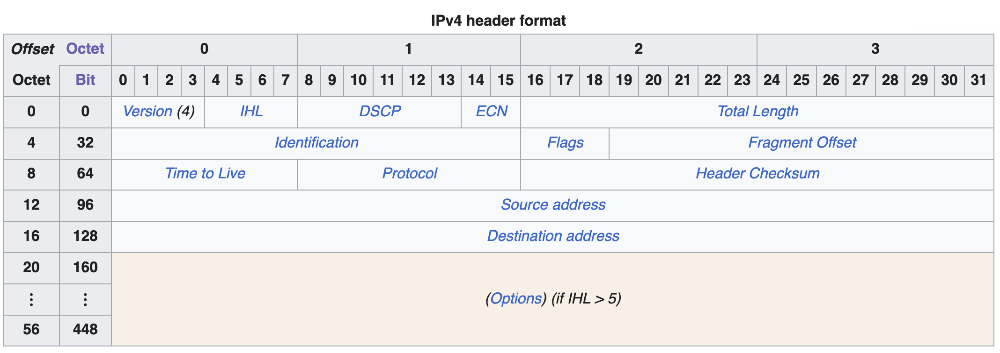
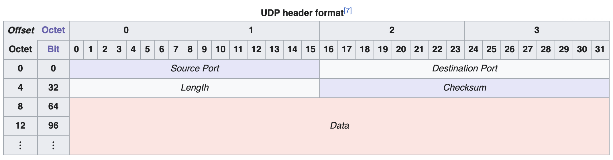
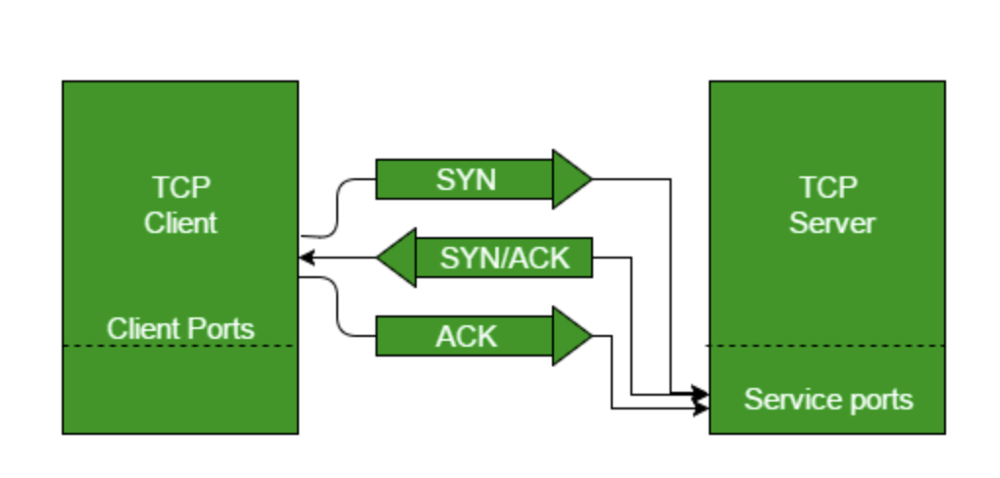
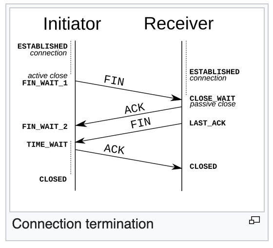
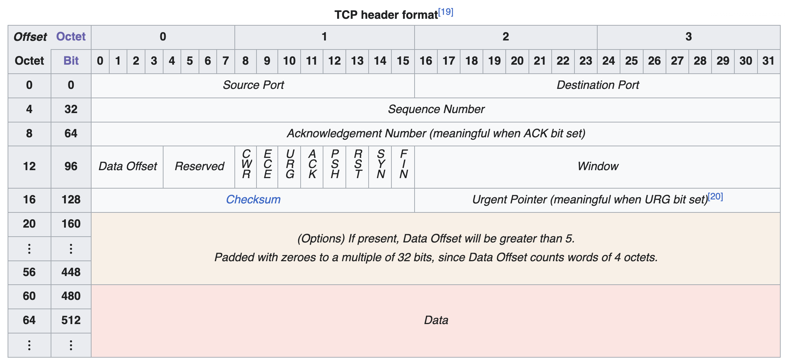
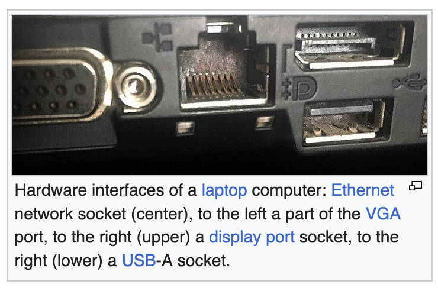

# Fundamentals of Networking

## OSI Model

Open Systems Interconnection

**Layers:**

- 7. Application (HTTP/gRPC)

- 6. Presentation (Serialize JSON)

- 5. Session (Establish connection - handshake - TLS)

- 4. Transport (UDP/TCP - Ports)

- 3. Network (IP Packet)

- 2. Data link (Frame)

- 1. Physical (Receive bit stream and converts them to physical signal like WIFI (radio), ethernet (electric), fiber (light). 

One shortcoming of this abstraction model is that is has **too many layers.** This is why the TCP/IP model tries to solve:

|                   | In relation to OSI      |
| ----------------- | ----------------------- |
| Application Layer | 7, 6, 5                 |
| Transport         | 4 (same)                |
| Internet          | 3 (same)                |
| Link              | 2 (DL) and 1 (physical) |

It is important to know *where* your application exists in the models in order to **optimize** them.

## Host to Host Communications

(OSI layers 2 and 3)

MAC Address: physical address of a machine in a network. It does not contain location/routing information. We require **routability**: a way of knowing where a host is within a network in order to send data.

This is where **IP address** comes in. It consists of two parts: **network** and **host**.

1. Identify network to send packets to

2. Identify host

3. Still needs MAC address

Ports handle which application receives the packet.

### IP Protocol

The IP building blocks

IP address: layer 3, automatic or statically set (DHCP)

Network and Host portions. IPv4 addresses are 32 bits (4 bytes)

Example: 192.168.254.0/24

    "/24" tells us which part of the address is **Network** and which is **Host**.

    192.168.254 refers to Network

    .0 is the Host. Usable hosts would be between .0 to .255. BUT, typically .0 is network address and .255 is broadcast address, so values are usually between .1 and .254

### Subnet mask

Is used to determine whether an IP address is in the same subnet.

A subnet mask is a 32-bit number that masks an IP address and divides the IP address into network and host portions. Example: `255.255.255.0` or `/24`. A bitwise AND operation between the IP address and subnet mask yields the network address.

### Default Gateway

A Host can talk to another Host directly if within the same network (subnet). Otherwise, the Host sends the message to the Gateway, which *might* know where to send it (might not know and might have to send it somewhere else that will, etc.).

A Gateway has an IP address and each host in a subnet should know their gateway's address.

In a home wifi, your gateway is the router that routes your requests to the internet.

### The IP Packet

**Headers** and **data** sections.

IP Header is 20 bytes (can increase to size 60 if options enabled).

Data Section can go up to 65,515 (65,535 minus header) bytes but the average is 1500. This is because the average Ethernet MTU (Maximum Transmission Unit). This is a common maximum.

Reference: [IPv4 - Wikipedia](https://en.wikipedia.org/wiki/IPv4#Packet_structure)

| Header                                      | Description                                                                     | Size    |
| ------------------------------------------- | ------------------------------------------------------------------------------- | ------- |
| Version                                     | v4 or v6                                                                        | 4 bits  |
| Internet Header Length                      | Defines options length. If IHL > 5 use extra options                            | 4 bits  |
| Total Length                                | Describes total length of the packet                                            | 16 bits |
| Fragmentation                               | Identification (16 bits), Flags; true/false (3 bits), Fragment Offset (13 bits) | 32 bits |
| Time to live                                | How many hops (through routers) can packet survive                              | 8 bits  |
| Protocol                                    | What protocol inside the data section                                           | 8 bits  |
| Source IP Address                           |                                                                                 | 32 bits |
| Destination IP Address                      |                                                                                 | 32 bits |
| DSCP/ToS + Explicit Congestion Notification |                                                                                 | 8 bits  |

#### Fragmentation

Why? If a packet is larger than MTU allowed in frame, we have to fragment.

#### TTL (Time to live)

If a packet never finds its destination it would live on forever. TTL exists to avoid this. Every time the packet goes through a router, the router subtracts one (100, 99, 98, ...). Last router that encounters TTL = 1, decrements TTL to 0 and must drop the packet and sends back ICMP Time Exceeded. This is the **ICMP**: Internet Control Message Protocol.

#### ICMP (Internet Control Message Protocol)

Designed for informational messages between hosts. For example:

- Host is unreachable

- We require fragmentation because packet is too large

- Packet expired

Doesn't require listeners or ports to be open. ICMP operates at layer 3, unlike TCP/UDP which use ports at layer 4.

An ICMP is **encapsulated in IP Packet with protocol set to (1) ICMP**.

|                | size    |
| -------------- | ------- |
| Type           | 1 byte  |
| Code           | 1 byte  |
| Checksum       | 2 bytes |
| Rest of header | 4 bytes |

Some firewalls block ICMP sometimes (this explains why `ping` may not work sometimes). Disabling ICMP can be problematic because there is no way of telling whoever is sending packets that something went wrong: what if we need fragmentation or the packet expired?

> NOTE: Traceroute
> 
> [traceroute](https://en.wikipedia.org/wiki/Traceroute) uses TTL by slowly increasing it in the ICMP Packets it's sending to find the path to the address.
> 
> Cool use of TTL

### ARP (Address Resolution Protocol)

In most cases we know the IP address of a Host but not their MAC address (which is the physical address of the machine - unique).

ARP is a lookup protocol that maps the MAC address to an IP address **within the same local network/subnet.**

For example, in your home wifi router there lives a table that knows the MAC addresses of the machines within the subnet, and it maps those addresses to IP addresses. If you want to send something from your computer to your phone, ARP will lookup the addresses in the table:

|           | IP address   | MAC address |
| --------- | ------------ | ----------- |
| Machine A | 192.168.1.10 | abc::efd    |
| Machine B | 192.168.1.20 | fzg::qrw    |
| Machine C | 192.168.1.30 | ytr:pjk     |

## UDP (User Datagram Protocol)

- Layer 4 in OSI Model.

- It is a **simple protocol** for sending and receiving data.

- Prior communication is **not** required.

- It has the ability to address **ports**.

- **Stateless.** No knowledge is stored in hosts.

- Small header: 8 bytes

- **No guaranteed delivery.**

Some use cases: Video streaming, VPNs, DNS, WebRTC

### Multiplexing and Demultiplexing

> Good reference: [Multiplexing and Demultiplexing in Transport Layer - GeeksforGeeks](https://www.geeksforgeeks.org/computer-networks/multiplexing-and-demultiplexing-in-transport-layer/)
> 
> This mechanism is also applicable in TCP (as both UDP and TCP are Layer 4 applications), which is covered further down in the notes.

Multiplexing and demultiplexing happen at the Transport layer of OSI Model, where **ports** exist. The idea behind ports is the ability to identify "processes", ie, "applications" running in the hosts, and being able to address them.

Hosts run many apps, ports identify the apps, and these protocols that handle ports know to which application the is delivered/received.

Sender multiplexes the data into UDP

Receiver demultiplexes the UDP datagrams to each app.

### UDP Datagram Structure

> Reference: [User Datagram Protocol - Wikipedia](https://en.wikipedia.org/wiki/User_Datagram_Protocol)

UDP header is 8 bytes only (in IPv4)

- Datagram slides into an IP packet as "data"

- Ports are 16 bit (0 to 65535, i.e. 2^16)

| header           | description                                                    | size    |
| ---------------- | -------------------------------------------------------------- | ------- |
| Source Port      |                                                                | 2 bytes |
| Destination Port |                                                                | 2 bytes |
| Length           | Length of data                                                 | 2 bytes |
| Checksum         | Value calculated to detect if data loss happened over transfer | 2 bytes |

#### Pros and cons

Simple protocol with small datagrams: they use less bandwidth, stateless, less memory consumption, and very low latency. 

The tradeoff is that there is no handshake (authentication), order of transmission, retransmission in case of transfer loss and no guaranteed delivery.

These are not *bad things* per se, they are the tradeoffs of the protocol. TCP has a lot of the things that UDP doesn't have, but the tradeoff in that case is the higher latency.

In the end, the decision over protocols comes down to what the application you are building requires.

## TCP/IP (Transmission Control Protocol)

- Layer 4 protocol (Transport)

- We can address ports (same as UDP)

- We can *control* the transmission of data (unlike in UDP)

- It is **stateful.** We have **state**, connection, session, and memory

- The connection requires a **handshake** in order to be established

- Large header: 20 bytes and can go up to 60

Some use cases are:

- Reliable connections

- Remote shell execution (SSH)

- Database communications (queries need to be ordered, if not the database will not know what to do.)

- Web communications

- Any **bidirectional** communication.

### TCP Connection

A TCP Connection is understood as a Layer 5 (Session) OSI Model application, even if it is a part of the TCP protocol (layer 4).

A TCP Connection is an agreement between a client and a server. The Connection must be established before either can send or receive data. 

The Connection is identified by four properties: **Source IP and Port**, and **Destination IP and Port**.

- This connection is sometimes referred to as "socket" or "file descriptor".

- Data can only be sent through this connection

- It requires the **three-way handshake** to be established

- The segments sent is **sequenced** and **ordered.** These segments are **acknowledged.**

- Lost segments are **retransmitted**, i.e., delivery is guaranteed.

#### Connection establishment: three-way handshake

Step 1: Client sends SYN (Synchronize Sequence Number) to server, indicating to the server that the client wishes to establish a connection and with what sequence number it will send segments with.

Step 2: The Server responds with SYN-ACK (ACK stands for Acknowledgement), indicating it received the initial SYN and provides it's own SYN telling the client it's sequence number.

Step 3: Client sends ACK, acknowledging the response of the server. They now establish a reliable connection.

> References: 
> 
> [TCP 3-Way Handshake Process - GeeksforGeeks](https://www.geeksforgeeks.org/computer-networks/tcp-3-way-handshake-process/)
> 
> [Transmission Control Protocol - Wikipedia](https://en.wikipedia.org/wiki/Transmission_Control_Protocol)

#### Data transmission

Sending and receiving data.

##### Sending Data

**Single segment**: App 1 sends data to App 2, data is encapsulated in segment, App 2 ACKs segment

**Multiple segments**: App 1 sends segments 1, 2 and 3 to App 2, App 2 ACKs the three segments with an ACK3 (last segment received).

##### Losing data

App 1 sends segments 1, 2 and 3 to App 2. Segment 3 is lost, App 2 acknowledges the first two segments (ACK2). App 1 resends Segment 3 and finally App 2 replies with ACK3.

#### Connection termination

- Fin ->

- Ack <-

- Fin <-

- Ack ->

> Reference: [Transmission Control Protocol - Wikipedia](https://en.wikipedia.org/wiki/Transmission_Control_Protocol)

### TCP Segment

> Reference: [Transmission Control Protocol - Wikipedia](https://en.wikipedia.org/wiki/Transmission_Control_Protocol)

- Header is 20 bytes (and can go up to 60)

- TCP segment slides into the IP Packet as "data"

- Ports are 16 bit (0 to 65535)

### Flow Control

*How much can the **receiver** handle?*

App 1 can send multiple segments to App 2, and App 2 can acknowledge all those segments with a single ACK. Our question is: **how many?**

The Receiver has a **buffer** where segments are placed before being processed, if the buffer fills, the receiver starts **dropping** the segments.

This is where the **Window** header comes into place. The receiver indicates the sender how much data/segments they can handle. It's updated with each ACK the receiver sends.

The **Sliding Window** is maintained by the Sender, adjusting to what the receiver indicates it it can handle.

> TCP uses a sliding window flow control protocol. In each TCP segment, the receiver specifies in the *receive window* field the amount of additionally received data (in bytes) that it is 
> willing to buffer for the connection. The sending host can send only up 
> to that amount of data before it must wait for an acknowledgment and 
> receive window update from the receiving host. [Transmission Control Protocol - Wikipedia](https://en.wikipedia.org/wiki/Transmission_Control_Protocol#Flow_control)

> Note: Window Scaling Factor allows the size of the segments to go up to a 1GB.

### Congestion Control

*How much can the **network** handle?*

Basically, the **routers** in the middle of the sender and receiver have their own limits (buffers) of how much traffic they can handle. We don't want to congest the network.

The Congestion window is handled by the sender.

>  Note: The Congestion Window cannot exceed the Receiver Window.

> These mechanisms control the rate of data entering the network, keeping the data flow below a rate that would trigger collapse... Acknowledgments for data sent, or the lack of acknowledgments, are used by senders to infer network conditions between the TCP sender and receiver. Coupled with timers, TCP senders and receivers can alter the behavior of the flow of data. This is more generally referred to as congestion control or congestion avoidance. [Transmission Control Protocol - Wikipedia](https://en.wikipedia.org/wiki/Transmission_Control_Protocol#Congestion_control)

There's two main algorithms that regulate the rate at which the sender sends data. It begins with the **slow start**, then, once the threshold is met, it switches over to **congestion avoidance** algorithm.

> Slow start algorithm doubles segments sent with each ACK received, once it reaches threshold, it switches to Congestion Avoidance, which only increases ONE segment every RTT (Round trip).

#### Congestion Notification

Routers can let us know when congestion hits through an ECN (Explicit Congestion Notification). Routers will tag an IP Packet with the ECN flag.

The receiver will COPY this ECN and send it back to the sender.

In order for routers to avoid dropping packages, they let us know beforehand.

### Network Address Translation (NAT)

*How the WAN (Wide Area Network) sees your internal devices.*

- It translates Private IPs to Public IPs (so we don't run out of IPv4 addresses; ~4 billion)

- A **NAT table** maps the Private IP ports to Public IP ports, rewrites the IP Packet and sends it on its way.
  
  - When the router receives the packet, the **destination port** of the incoming package is looked up in the NAT table in order to find which Private IP of the Host machine the packet is destined to. Then, packet destination is rewritten and sent on its way.

Some use cases are:

- Port forwarding: You can create an entry in the NAT table to forward packets destined to Port 80 to a machine in your LAN.

- Layer 4 Load Balancing: A client sends a request to a virtual IP address, the router intercepts the packet and replaces the virtual IP with the destination server IP.

- Layer 4 Reverse Proxying.

### TCP Connection States

*A **stateful** protocol must have states.*

- Both the client and the server need to maintain all sorts of states: window sizes, sequences, connection states.

- A connection goes through many states.

### Pros and cons of TCP

**Pros**

- Guaranteed delivery

- Flow control and congestion control

- Secure

- Data cannot be sent without prior knowledge

- Ordered packets and no corruption.

**Cons**

- Large header, higher latency, more bandwidth use, memory consumption due to state.

- **TCP Head of Line Blocking**: this is an issue where Segments 1, 2 and 3 are sent, 2 and 3 arrive, but 1 does not. We cannot do anything with segments 2 and 3. The client has to resend everything. This actually one of the reasons QUIC was invented.

- TCP Meltdown, not good for VPN.

## Popular Network Protocols

IP, the Internet Protocol, is the building block of everything. Everything is IP Packets. UDP and TCP Protocols are built on top of IP, and everything  else (mostly) is built on top of UDP or TCP.

### DNS

Domain Name System

DNS exists because for humans, remembering IP addresses is hard, it is much easier to remember a text. DNS "translates" `google.com` into `192.178.50.46`. 

- A domain is a text that points to an IP address or a *collection* of IP addresses. This is useful for many reason, one would be Load Balancing.

- An IP address can change but our domain can remain the same.

- We can serve our site closer to the client IP requesting on the same domain (CDN).

- DNS has many kinds of records for different uses: MX, TXT, A, CNAME.

- DNS Packet "slides" into a **UDP** Packet

- It has a **Transaction ID** header.

#### How DNS works

A client would like to navigate to `google.com` but it does not know the IP address. The client needs to ask a **DNS resolver** for the IP address.

1. Client wants IP address for `google.com`, it sends a DNS Packet to a Resolver with its query.

2. The resolver gets query for `google.com` and queries a ROOT server asking it for the address of the servers holding the `.com` domain information. ROOT server responds to the resolver with that address, the TLD (Top Level Domain servers).

3. The resolver now queries the TLD server with the `.com` domains and asks for `google`. The TLD server responds with the address of the ANS (Authoritative Name Server).

4. The resolver now queries the ANS for the IP address of `google.com`, to which the ANS responds with `192.178.50.46`.

5. Finally, the resolver responds to the client with the IP address.

### TLS

*Transport Layer Security*

HTTP doesn't use TLS. It's an unencrypted protocol. When you do a GET request in HTTP, the HTML file can be read by anyone while traveling through the transport layer.

HTTPS, on the other hand, is **HTTP over TLS.** There is a symmetric encryption: both the client and the server have the same key, the HTML file travels encrypted and is unencrypted in the client.

> Diffie Hellman is the TLS encryption protocol, we'll see how it works later in the document.

#### HTTPS

*Understanding HTTPS/TLS*

- **H**yper**t**ext **T**ransfer **P**rotocol (**S**ecure)

- Client/server protocol

- Sits on top of **TLS**

#### Encryption

Two kinds of encryption: symmetric and asymmetric

**Symmetric:** You encrypt and decrypt with the same key. Fast, but the client and the server must have the same key.

**Asymmetric:** You encrypt with one key and decrypt with another key. Two keys: a **public** key and a **private** key.

- Encrypt with the public key.

- Decrypt with the private key.

- Public and Private key rules:
  
  - Public and private keys come in **pairs**
  
  - The private key can **generate** the public key. The public key **cannot** generate the private key.

*Encrypting with Public key*

- If someone has handed you their public key, you can encrypt a message with that key and sent it over to them. They will decrypt it with their private key.
  
  > [Public-key cryptography - Wikipedia](https://en.wikipedia.org/wiki/Public-key_cryptography)

*Encrypting with the Private key*

- Example is digital signature
  
  - Generate public and private key pair
  
  - You generate a **signature** from a **message** and a **private key**
  
  - You **verify the signature** using the **message**, the **signature** and the **public key**.

> [Digital signature - Wikipedia](https://en.wikipedia.org/wiki/Digital_signature)

#### Certificates

Certificates are a way of **proving authenticity.** A common usage is in **HTTPS**, where a website proves it's authenticity by providing a certificate.

> "A digital certificate certifies the ownership of a public key by the 
> named subject of the certificate. This allows others (relying parties) 
> to rely upon signatures or on assertions made about the private key that
>  corresponds to the certified public key. A CA acts as a trusted third 
> party—trusted both by the subject (owner) of the certificate and by the 
> party relying upon the certificate. The format of these certificates is specified by the X.509 or EMV standard."
> 
> [Certificate authority - Wikipedia](https://en.wikipedia.org/wiki/Certificate_authority)

#### How TLS encryption works

- TLS uses **symmetric keys**, but exchanges them using **asymmetric encryption**.

- Exchanges new keys for every session

- A certificate is shared in order to provide **authentication**

- Diffie Hellman is the encryption method. Both parties agree on shared parameters, each of them combine them with their private key generating a public key that can be shared publicly, but only each other will be able to decrypt each others messages with their own private key that was never shared.

> [Diffie–Hellman key exchange - Wikipedia](https://en.wikipedia.org/wiki/Diffie%E2%80%93Hellman_key_exchange)

### Network Performance

*What is the relationship between **MSS** (Maximum Segment Size) and **MTU** (Maximum Transmission Unit)*

- The **Segment** is part of TCP (Layer 4)
  
  - which "slides" into the **IP Packet** (Layer 3)
    
    - which then "slides" into the **Frame** (Layer 2)
    
    - The **Frame** has a fixed size that is determined by networking configuration. The Frame **determines** the size of the Segment

#### Hardware MTU

The Maximum Transmission Unit is the **size of the frame**. The Network default is 1500 bytes. You can check your Network configurations and will find something like this. Some networks can have bigger size frames.

#### IP Packets and MTU

IP packets usually equal the MTU. One IP Packet *should* fit one frame, but if a IP Packet is larger than the frame, it will be fragmented.

#### MSS

Maximum Segment Size is based on the MTU. Segments themselves should fit into the IP Packet which will then fit inside the Frame.

> MSS = MTU - IP Headers - TCP Headers
> 
> MSS = 1500 - 20 - 20 = 1460 bytes

#### Path MTU Discovery (PMTUD)

*What if the network can't handle the frame size?*

A router routing the frames you are sending to another party may not be able to handle that size of frame.

MTU is a **network interface property**, each host can have a different MTU value. You must use the **smallest** MTU in the network. This is the objective of PMTUD.

In order to do this:

- The client sends an IP Packet with it's default MTU (let's say 1500) with a DF flag.

- If a host in the middle (a router) has a smaller MTU and cannot fragment the packet, it will drop it and send an ICMP message back to the client saying "fragmentation needed".

- The client will adjust and lower its MTU

#### Nagle's Algorithm and Delayed Acknowledgment

Nagle's Algorithm and Delayed Acknowledgment are both algorithms for delaying sending/responding segments. Their intention is to improve performance, but have been found to be problematic.

**Nagle's Algorithm** *client-side delay*

The client wants to send as many segments as it can in a single frame. For example, it has two frames, one of 500 and another of 1000. Instead of sending each segment in separate frames, it waits for both to be ready and sends them in the same frame.

- So, let's say one request we send has three segments, two of them fit neatly in 1500, the third one is too small, so the algorithm waits instead of just sending it in a smaller frame. This increases **latency**, which for us means **poor performance**.

> [Nagle's algorithm - Wikipedia](https://en.wikipedia.org/wiki/Nagle's_algorithm)

**Delayed Acknowledgement** *server-side delay*

It is wasteful to acknowledge (ACK) every single segment, so we can wait and send one ACK to acknowledge a series of segments.

If we were to use both Nagle's Algorithm and Delayed Acknowledgement, we could end up in a situation where both parties are **waiting for each other** (this can lead to 400ms delays).

These can be **enabled/disabled** via options on low level configurations:

- Nagle's Algorithm is set via `TCP_NODELAY` option

- Delayed Acknowledgment is set via `TCP_QUICKACK` option

#### Cost of connections

*Cost is latency*

There are a lot of things that increase latency: TCP handshake, long distances, slow start algorithm, congestion and flow control, Nagle and Delayed Ack, etc.

This means that **establishing connections** is **costly**, which means that we should want to **keep connections alive**.

**Connection Pooling** allows us to do this. For example, we could create a Reverse Proxy, in which our "front-end" server establishes a bunch of connections and keeps them alive with the "back-end" servers that hold the data, like a database. A client would do a request to the RP server, which would then **reserve an existing connection**, use it and forward the response to the client. This means the connection remains **warm**, and everything is faster, latency is reduced.

#### Eager vs Lazy loading

**Eager**: load everything from the start. Start up is slow but requests are served very quickly.

**Lazy:** load on demand. Start up is fast (because loading only what's needed), but initial requests are slower.

#### TCP Fast Open

TCP requires the initial three-way handshake in order to start a connection. TCP Fast Open sends data in that initial handshake.

> [TCP Fast Open - Wikipedia](https://en.wikipedia.org/wiki/TCP_Fast_Open)

### Listening Server

*What does it mean to listen? What is happening when we do* `server.listen()`?

Hosts have **interfaces**.

> An **interface** is a shared boundary across which two or more separate components of a computer system exchange information.
> 
> Reference: [Interface (computing) - Wikipedia](https://en.wikipedia.org/wiki/Interface_(computing))

> Note: On Linux you can run `ip addr` to get a list of the host's interfaces

For our use cases, a host may have an interface for Wifi, another one for Ethernet, and maybe for each will have the IPv4 and IPv6 versions. We, as software engineers building a server must tell it to **listen** on which interface and port.

Usually, there are exceptions, we can only have one process (application) listening to a IP address and port pair. The IP address will correspond to a single interface.

For example:

`listen("127.0.0.1", 8080)` is listening on the localhost IPv4 interface on port 8080.

`listen("::1", 8080)` is listening on the localhost IPv6 interface on port 8080.

`listen("0.0.0.0", 8080)` is listening on **all** interfaces on port 8080. This is not recommended and can be very dangerous.

### Proxy vs Reverse Proxy

A **Proxy** is a server that makes request *on your behalf.*

> Instead of connecting directly to a server that can fulfil a request for a resource, such as a file or web page, the client directs the request to the proxy server, which evaluates the request and performs the required network transactions. [Proxy server - Wikipedia](https://en.wikipedia.org/wiki/Proxy_server)

A **Reverse Proxy** appears as a normal server but in reality it acts as an intermediary between the client and the "real" servers.

> A reverse proxy or surrogate server is a proxy server that appears to any client to be an ordinary web server, but in reality merely acts as an intermediary that forwards the client's requests to one or more ordinary web servers. [Reverse proxy - Wikipedia](https://en.wikipedia.org/wiki/Reverse_proxy)

In a **Proxy** the client *knows* the proxy server is a proxy server, and is deciding to go through it. The final destination of the request, *doesn't know* that their response is going to a proxy.

In a **Reverse Proxy** the client *doesn't* know it is talking to a proxy.

#### Proxy

Let's say you want to visit `google.com` through a proxy called `my-proxy.com`.

You send a request to the proxy server and the server does the request to google, gets the response and sends you the response.

Some use cases are:

- anonimity

- caching

- logging

- blocking sites

- microservices

#### Reverse Proxy

Let's say you want to go to `google.com`. Google is a very popular site that receives many requests so they have a reverse proxy put in place where there is a "front-end" server that get's your request, but then "redirects" the request to another "back-end" server that actually executes your request. You, as the client, never know of the existence of this other server behind the scenes.

Some use cases are:

- Load Balancing

- Ingress

- Microservices

- Caching (CDN)

- Canary Deployments

#### Differences between a Layer 4 and a Layer 7 Load Balancer

> Load balancing is the process of distributing a set of tasks over a set of resources (computing units) with the aim of making their overall processing more efficient. [Load balancing (computing) - Wikipedia](https://en.wikipedia.org/wiki/Load_balancing_(computing))

A **Layer 4** Load Balancer is working with segments and is basically just redirecting these segments to other servers.

It is **simple** because it is not looking into the segment to see the data, it's **secure** because it works with any protocol, and it's **fast**. Inversely, because you are not looking at the data, you cannot make "smart decisions" as of *how* to load balance.

Can't cache. Can't set any rules because you're unaware of the segment protocols. Microservices don't apply.

A **Layer 7** Load Balancer is **smart** because it reads the data and makes decisions from what it finds.

Pros are smart load balancing, great for microservices, cache, authentication, API gateway logic. Cons are that data lookup is expensive, you have to decrypt (which terminates the TLS), you need to maintain two TCP connection, needs to buffer, must share the TLS cert and needs to understand the protocol of the incoming requests.

